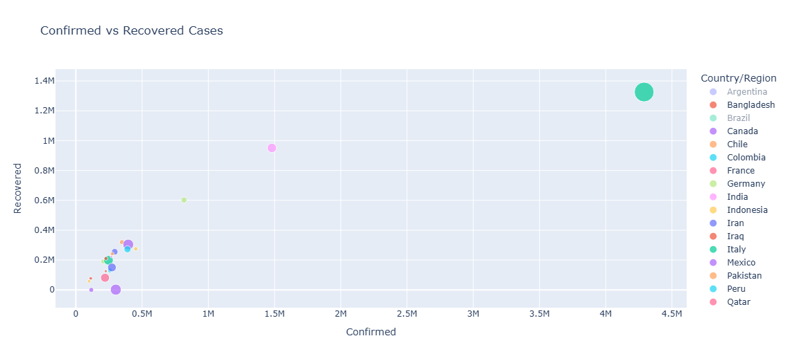

# 📊 COVID-19 Global Data Analysis   

## 📌 Introduction

This project analyzes global COVID-19 data to extract meaningful insights using data visualization techniques.
The dataset includes confirmed cases, deaths, recoveries, and geographic information across different countries and dates.

## 🎯 Objectives

Understand the global spread of COVID-19 over time
Identify the most affected countries
Analyze recovery vs death trends
Extract meaningful insights using data visualization

## 🛠️ Technologies Used

 
  
 

## 🧠 Key Concepts

Data Cleaning: Handling missing values and formatting dates
Data Aggregation: Grouping data at the country level
Feature Engineering: Creating Active Cases from existing features
Time Series Analysis: Analyzing data trends over time
Data Visualization: Using charts (line, bar, scatter, pie)
Descriptive Analysis: Extracting insights without predictive models
Rate Calculation: Computing death and recovery rates
Trend Analysis: Identifying patterns and changes over time

## 👩‍💻 Contributors

* @menna-ibrahim
* @djokerbat
* @MennaAlarabi
